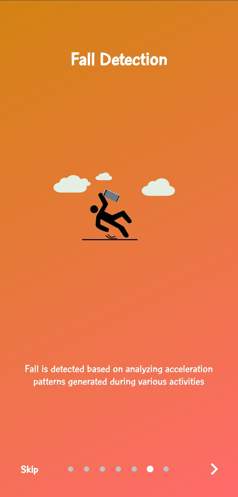

# Leo App

Leo App consists of an Android app for both users and Designated responsible operator.

The app is written in Kotlin and based on [MVVM(Model-View-ViewModel)](https://developer.android.com/jetpack/guide) architecture. Users can view crime precautions and news in their region and can mark or unmark themselves in trouble. The app also provides crime hotspots in particular region.


## Installation

1. Download the Zip from the website or clone from Github Desktop.
2. Unzip the github project to a folder. (If you have downloaded it)
3. Open Android Studio. Go to File -> New -> Import Project. Then choose the Leo_Kotlin folder and then click Next->Finish.
4. It will build the Gradle automatically and'll be ready for you to use. (Make sure you are connected to internet)
5.  In some versions of Android Studio a certain error occurs-
error:package android.support.v4.app does not exist.
To fix it go to Gradle Scripts->build.gradle(Module:app) and the add the dependecies:
```
dependencies {      
    compile fileTree(dir: 'libs', include: ['*.jar'])  
    implementation 'androidx.appcompat:appcompat:1.1.0' 
}
```

## Screenshots

<div style="display:flex;">




</div>

## Features


- Travel Safe
  - Intuitive map of crime hotspots in your region.
  - Crime hotspots are colored according to frequency of crimes in region.
- Recent Crime News
  - Get to know recent crime incidents in your region.
- Live location Tracking
  - The location is stored locally on your smartphone.
  - Remembers your last location. 
  - User can explicity share your location via different platforms. 
  - Location is implicitly shared only when trouble is detected.
- SMS Notification
  - Peers are notified via SMS when detected in trouble
- Power Button Detection
  - Trouble is detected when power button is pressed 5 times.
- WiFi Direct
  - To create p2p connections with nearby peers so trouble detection can seamlessly work even when there is no cellular reception.
- Fall Detection
  - Detecting trouble when mobile falls using algorithm applied on data received through accelerometer sensor.
- Quick Settings Tile
  - Quick settings tile in system panel to easily notify when you are in trouble.


## Directory structure

```
.
├── app ->  Containes the application relevant files.
│   ├── build.gradle(app-level) ->  to automate and manage the build process.
│   ├── debug -> contains debug version of apk.
│   ├── release -> Contains release version of apk.
│   └── src -> Contains source files for the application.
│       ├── main ->contains all the source code files.
│       │   ├── AndroidManifest.xml -> describes essential information about app.
│       │   ├── java/com/rohit2810/leo_kotlin
│       │   │    ├── Application.kt -> base class containing components like Activities and Services
│       │   │    ├── MainActivity.kt -> base activity for all fragments
│       │   │    ├── database -> contains all the database related files.
│       │   │    ├── models -> contains all the model classes.
│       │   │    ├── network -> contains interfaces to simplify api calls.
│       │   │    ├── receivers -> contains receivers for power button and notifications.
│       │   │    ├── repository -> contains design patterns that isolates data sources from the rest of the app.
│       │   │    ├── services
│       │   │    ├── ui -> contains the ui files for every fragments
│       │   │    │   ├── emergencyContacts
│       │   │    │   ├── intro
│       │   │    │   ├── login
│       │   │    │   ├── main
│       │   │    │   ├── map
│       │   │    │   ├── news
│       │   │    │   ├── otp
│       │   │    │   ├── permissionRequest
│       │   │    │   ├── register
│       │   │    │   ├── settings
│       │   │    │   └── splash
│       │   │    └── utils -> contains the utility functions
│       │   └── res -> Contains resource files written in xml for the application.
│       │       ├── anim -> contains animation files.
│       │       ├── drawable -> contains logos and vector assets.
│       │       ├── layout -> contains layout files for every fragment.
│       │       ├── menu -> contains layout file for menu.
│       │       ├── navigation -> contains navigation graph.
│       │       ├── raw -> contains lottie animation files.
│       │       ├── values -> contains values of colors, strings etc.
│       │       └── xml-> contains xml file for network security config.
└── build.gradle -> to automate and manage the build process.


```

## Deployment

1. Go to Build -> Generate Signed APK
2. Choose APK -> Next
3. If you already have keystore use that otherwise Click on create new. fill in the form with the required details.
Click on the icon on the right with the 3 dots ("..."), which will open up a navigator window asking you to navigate and select a .jks file.Navigate to a folder where you want your keystore file saved.
4. Create a key for your application and fill in all the required details.
5. Click on Next and then select Release.
6. You will get popup indicating the apk file path when android studio finishes build.

## Built With

- [Jetpack Navigation](https://developer.android.com/guide/navigation) - Helps in implementing navigation across different fragments.
- [Android lifecycle extension](https://developer.android.com/jetpack/androidx/releases/lifecycle) -  These components help you produce better-organized, and often lighter-weight code, that is easier to maintain.
- [Retrofit](https://square.github.io/retrofit/) - Retrofit is the class through which your API interfaces are turned into callable objects. Used to make network requests in android.
- [Moshi](https://github.com/square/moshi) - Modern JSON library for Android and Java
- [Lottie](https://github.com/airbnb/lottie-android) -  Mobile library for Android and iOS that parses Adobe After Effects animations
- [Glide](https://github.com/bumptech/glide) - Fast and efficient open source media management and image loading framework
- [Room Persistence](https://developer.android.com/topic/libraries/architecture/room) - Provides an abstraction layer over SQLite.
- [Data Binding](https://developer.android.com/topic/libraries/data-binding) - Support library that allows to bind UI components in layouts to data sources in app

## Contributing

To be filled later

## License

This project is licensed under the MIT License - see the [LICENSE.md](LICENSE.md) file for details

